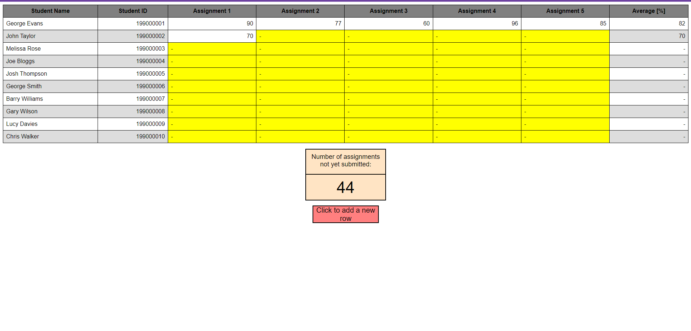

# Grade-Calculator
A HTML application in which you can enter the grades of students for 5 assignments, the average grade of these assignments for each student is displayed in the last column.
You can add more students to the table by clicking the "Click to add a new row" button.
If a students average grade is below the treshhold for a pass (<60%), their average grade will be highlighted in red.
Grades can be edited by clicking on the cell.
Developed to put my learning of HTML into pratice.

